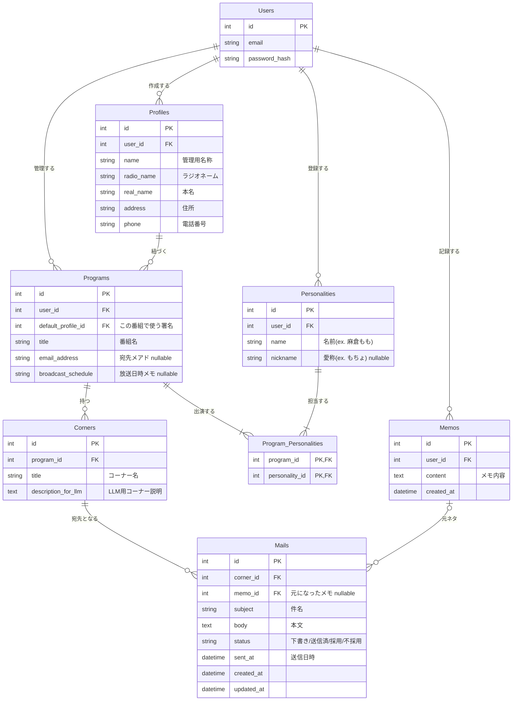

```mermaid
erDiagram
    Users ||--o{ Profiles : "作成する"
    Users ||--o{ Programs : "管理する"
    Users ||--o{ Personalities : "登録する"
    Users ||--o{ Memos : "記録する"
    
    Profiles ||--o{ Programs : "紐づく"
    
    %% 多対多の関係解消用テーブル
    Programs ||--|{ Program_Personalities : "出演する"
    Personalities ||--|{ Program_Personalities : "担当する"
    
    Programs ||--o{ Corners : "持つ"
    Corners ||--o{ Mails : "宛先となる"
    Memos |o--o{ Mails : "元ネタ"

    Users {
        int id PK
        string email
        string password_hash
    }

    Profiles {
        int id PK
        int user_id FK
        string name "管理用名称"
        string radio_name "ラジオネーム"
        string real_name "本名"
        string address "住所"
        string phone "電話番号"
    }

    Program_Personalities {
        int program_id PK, FK
        int personality_id PK, FK
    }

    Personalities {
        int id PK
        int user_id FK
        string name "名前(ex. 麻倉もも)"
        string nickname "愛称(ex. もちょ) nullable"
    }

    Programs {
        int id PK
        int user_id FK
        int default_profile_id FK "この番組で使う署名"
        string title "番組名"
        string email_address "宛先メアド nullable"
        string broadcast_schedule "放送日時メモ nullable"
    }

    Corners {
        int id PK
        int program_id FK
        string title "コーナー名"
        text description_for_llm "LLM用コーナー説明"
    }

    Memos {
        int id PK
        int user_id FK
        text content "メモ内容"
        datetime created_at
    }

    Mails {
        int id PK
        int corner_id FK
        int memo_id FK "元になったメモ nullable"
        string subject "件名"
        text body "本文"
        string status "下書き/送信済/採用/不採用"
        datetime sent_at "送信日時"
        datetime created_at
        datetime updated_at
    }
```