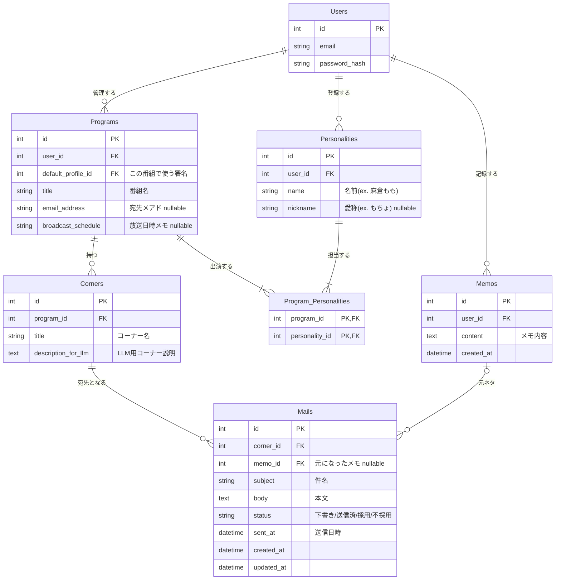

## アプリ名
RadioManageApp

## コンセプト
ラジオリスナーの「メール投稿を継続しやすくする」ためのツール。

### 解決する課題
- 日常で思いついたネタをすぐ忘れてしまう
- 複数の局・番組・コーナーがあり、どこに投稿すべきか迷う
- 過去の投稿履歴を管理できず、採用状況がわからない
- 複数の放送局にまたがるラジオ情報を個別に管理するのが煩雑

### 特徴
- 思いついた瞬間にメモを残せる
- AIが最適な投稿先コーナーを提案
- 投稿履歴と採用状況を一元管理
- 複数の局にまたがるラジオ番組の情報を一箇所で管理

## 対象OSおよびブラウザ
下記のブラウザの最新2バージョンが利用できるOS
- Google Chrome
- Firefox
- Microsoft Edge
- Safari

### 開発環境
MacBook Air M3(2024)
Docker Desktop

### 言語・ライブラリ

#### フロントエンド
Language: Python 3.11
Framework: Streamlit
HTTP Client: requests

#### バックエンド
Language: Python 3.11
Framework: FastAPI
ORM: SQLAlchemy

### 開発期間
2026年1月12日 ~ 

## 主な機能
ラジオ情報を一元管理するアプリケーション

### 概要
- ラジオメールのネタになりそうなことをメモ
- メモの内容から投稿する推奨コーナーをAIが選出
- 各番組に紐づくメールの作成と管理

#### メモ管理
- メモ一覧表示
- メモ作成
- メモ削除
- メモ検索

#### 番組管理
- 番組一覧表示
- 番組作成
- 番組削除
- パーソナリティでの絞り込み
- 番組名での部分一致検索
- コーナー一覧表示

#### メール作成
- AI解析による推奨コーナー
- 手動コーナー選択
- プロフィール選択
- OS標準メーラー起動

### テーブル定義


### 開発環境構築手順

#### 前提条件
- Docker Desktop がインストールされていること
- Git がインストールされていること
- Google AI Studio で Gemini API キーを取得していること

#### 初回セットアップ
1. 本リポジトリをclone
   ```bash
   git clone <repository-url>
   cd radio-corner-selector
   ```

2. 環境変数の設定
   ```bash
   # backend/.env ファイルを作成
   echo "GEMINI_API_KEY=your_api_key_here" > backend/.env
   ```

3. Dockerコンテナのビルドと起動
   ```bash
   docker compose build
   docker compose up
   ```
   - バックグラウンドで起動する場合: `docker compose up -d`

4. アプリケーションへアクセス
   - **フロントエンド**: http://localhost:8501
   - **バックエンドAPI**: http://localhost:8000
   - **API ドキュメント**: http://localhost:8000/docs

### こだわったポイント

#### 1. ラジオ投稿専用のメモ機能
日々の生活の中で「これはラジオメールのネタになりそう！」と思う瞬間は多々あります。しかし、その場でどの番組に投稿するか、どんな文面にするかを考えるのは難しく、メモを取らなければすぐに忘れてしまいます。

スマートフォンの標準メモアプリでも記録は可能ですが、日常の買い物リストや仕事のメモなど、他のメモに埋もれてしまいがちです。そこで**ラジオ投稿専用のメモ機能**を実装することで、ラジオメールのネタ用のメモを一元化し、管理しやすくしました。

#### 2. AI による推奨コーナー選定機能
ラジオリスナーの多くは複数の番組を聴いており、それぞれの番組には複数のコーナーが存在します。例えば、ふとした日常の出来事が「ふつおた」なのか「〇〇あるある」なのか、はたまた別のコーナーに適しているのか、判断に迷うことがあります。

このアプリでは、LLMを活用し、メモ内容と各コーナーの特徴と照らし合わせることで、適した投稿先を提案します。

#### 3. 投稿履歴の一元管理
複数の局・番組にまたがる投稿履歴を一箇所で管理できるようにしました。送信日時や採用・不採用のステータスを記録することで、「どの番組に何を送ったか」「どのネタが採用されたか」を振り返ることができ、今後の投稿戦略の参考になります。

### デザイン面でこだわったポイント

#### シンプルで直感的なUI設計
Streamlitの特性を活かし、シンプルなデザインを採用しています。ラジオリスナーが「思いついたらすぐに記録する」「素早くコーナーを選択する」という行動を妨げないよう、視覚的なノイズを最小限に抑えました。

#### 情報の視認性を重視したレイアウト
メモ一覧や番組一覧では、カード型のレイアウトを採用することで、各項目の境界を明確にし、情報の把握を容易にしています。特に番組管理画面では、番組名・パーソナリティ・放送スケジュール・コーナー数などの重要情報を、視線の流れに沿って配置することで、内容を把握しやすいよう意識しました。

#### ステータスの色分けによる視覚的フィードバック
メール管理画面では、投稿のステータス（下書き・送信済み・採用・不採用）を色で区別することで、一覧性を高めています。特に「採用」ステータスを目立つ色にすることで、ユーザーのモチベーション維持に貢献します。

#### レスポンシブ対応とモバイルファースト
Streamlitのレスポンシブ機能を活用し、デスクトップ・タブレット・スマートフォンのいずれでも快適に操作できるよう最適化しています。特に「メモの記録」という最も頻度の高い操作は、移動中や思いついた瞬間にスマートフォンから行うことを想定し、ダッシュボードにクイックメモ機能を搭載しました。

### 技術面でアドバイスして欲しいポイント

#### 1. UI/UXデザインの改善
デザインについて学習する機会が少なかったため、以下の点についてフィードバックをいただきたいです：
- 使いにくい色使いや配色になっていないか
- コンポーネントの配置が直感的でない箇所がないか
- ユーザビリティを損なうデザイン要素がないか

#### 2. プロンプト最適化とベクトル検索の導入
**現在の課題：**
番組とコーナーの数が増加すると、LLMに渡すプロンプトのサイズが肥大化し、将来的に推論精度が低下する可能性があります。

**検討中の解決策：**
LLMに渡す前に、ベクトル検索を用いてメモ内容とコーナー説明文の類似度を計算し、関連性の高いコーナーに絞り込むことで、プロンプトサイズを削減する方針を考えています。

**この実装における課題：**
- コーナー追加時にベクトル化処理が走るため、ユーザーを待たせてしまう
- 推奨コーナー推論時にもブロッキング処理が発生する

**アドバイスを頂きたい点：**
UXを向上させるために、以下の観点でアドバイスをいただきたいです：
- 処理中の待機時間を軽減するための適切なUI表示方法（ローディング表示、プログレスバー等）
- 非同期処理やバックグラウンドタスクを活用したバックエンド構成の最適化

### 自己評価

#### 達成できた点
当初に実装を目指していた以下の主要機能を実現できた点に満足しています：
- **ラジオ情報の一元化** - 複数の番組・コーナー情報を統合的に管理
- **投稿履歴の管理** - 過去のメールを振り返りやすい仕組みの構築
- **AI による推奨コーナー提案** - メモ内容から最適な投稿先を自動推薦

#### 今後の改善点と実装予定

**1. ビジュアル面の強化**
現在のUIは機能性を重視したシンプルな設計ですが、やや殺風景に感じる部分があります。今後は以下の機能追加を検討しています：
- 番組のプロフィール画像（カバー画像）の設定機能
- より視覚的に魅力的なカード表示の実装

**2. ベクトル検索の導入とエージェント化**
前述の技術的課題に対応するため、以下の実装を計画しています：
- LangChainを活用したベクトル検索とLLM推論の統合
- エージェンティックなワークフロー（ベクトル検索 → 候補絞り込み → LLM推論）の構築
- より効率的で精度の高いコーナー推薦システムの実現