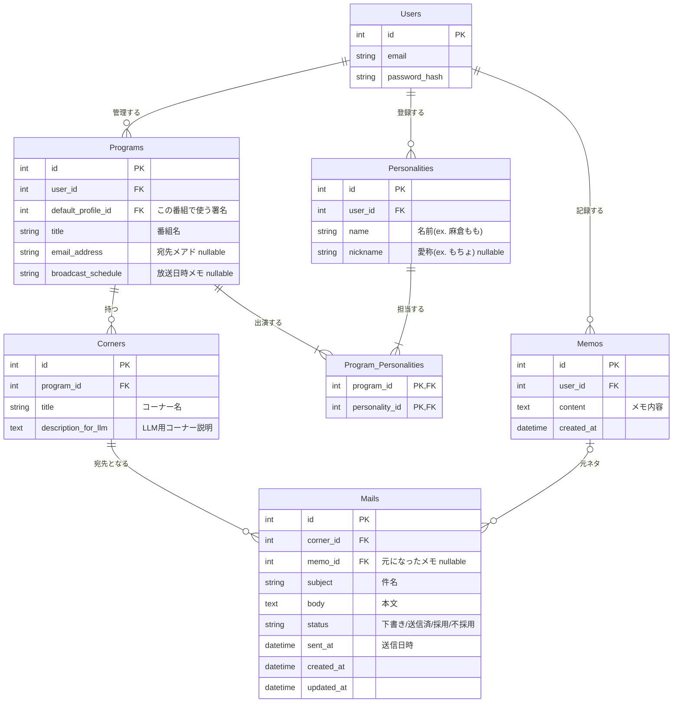

## アプリ名
RadioManageApp

## コンセプト
ラジオリスナーの「メール投稿を継続しやすくする」ためのツール。

### 解決する課題
- 日常で思いついたネタをすぐ忘れてしまう
- 複数の局・番組・コーナーがあり、どこに投稿すべきか迷う
- 過去の投稿履歴を管理できず、採用状況がわからない
- 複数の放送局にまたがるラジオ情報を個別に管理するのが煩雑

### 特徴
- 思いついた瞬間にメモを残せる
- AIが最適な投稿先コーナーを提案
- 投稿履歴と採用状況を一元管理
- 複数の局にまたがるラジオ番組の情報を一箇所で管理

## 対象OSおよびブラウザ
下記のブラウザの最新2バージョンが利用できるOS
- Google Chrome
- Firefox
- Microsoft Edge
- Safari

### 開発環境
MacBook Air M3(2024)
Docker Desktop

### 言語・ライブラリ

#### フロントエンド
Language: Python 3.11
Framework: Streamlit
HTTP Client: requests

#### バックエンド
Language: Python 3.11
Framework: FastAPI
ORM: SQLAlchemy

### 開発期間
2026年1月12日 ~ 

## 主な機能
ラジオ情報を一元管理するアプリケーション

### 概要
- ラジオメールのネタになりそうなことをメモ
- メモの内容から投稿する推奨コーナーをAIが選出
- 各番組に紐づくメールの作成と管理

#### メモ管理
- メモ一覧表示
- メモ作成
- メモ削除
- メモ検索

#### 番組管理
- 番組一覧表示
- 番組作成
- 番組削除
- パーソナリティでの絞り込み
- 番組名での部分一致検索
- コーナー一覧表示

#### メール作成
- AI解析による推奨コーナー
- 手動コーナー選択
- プロフィール選択
- OS標準メーラー起動

### テーブル定義

```mermaid
erDiagram
    Users ||--o{ Programs : "管理する"
    Users ||--o{ Personalities : "登録する"
    Users ||--o{ Memos : "記録する"
    
    %% 多対多の関係解消用テーブル
    Programs ||--|{ Program_Personalities : "出演する"
    Personalities ||--|{ Program_Personalities : "担当する"
    
    Programs ||--o{ Corners : "持つ"
    Corners ||--o{ Mails : "宛先となる"
    Memos |o--o{ Mails : "元ネタ"

    Users {
        int id PK
        string email
        string password_hash
    }

    Program_Personalities {
        int program_id PK, FK
        int personality_id PK, FK
    }

    Personalities {
        int id PK
        int user_id FK
        string name "名前(ex. 麻倉もも)"
        string nickname "愛称(ex. もちょ) nullable"
    }

    Programs {
        int id PK
        int user_id FK
        int default_profile_id FK "この番組で使う署名"
        string title "番組名"
        string email_address "宛先メアド nullable"
        string broadcast_schedule "放送日時メモ nullable"
    }

    Corners {
        int id PK
        int program_id FK
        string title "コーナー名"
        text description_for_llm "LLM用コーナー説明"
    }

    Memos {
        int id PK
        int user_id FK
        text content "メモ内容"
        datetime created_at
    }

    Mails {
        int id PK
        int corner_id FK
        int memo_id FK "元になったメモ nullable"
        string subject "件名"
        text body "本文"
        string status "下書き/送信済/採用/不採用"
        datetime sent_at "送信日時"
        datetime created_at
        datetime updated_at
    }
```

### 開発環境構築手順

#### 前提条件
- Docker Desktop がインストールされていること
- Git がインストールされていること
- Google AI Studio で Gemini API キーを取得していること

#### 初回セットアップ
1. 本リポジトリをclone
   ```bash
   git clone <repository-url>
   cd radio-corner-selector
   ```

2. 環境変数の設定
   ```bash
   # backend/.env ファイルを作成
   echo "GEMINI_API_KEY=your_api_key_here" > backend/.env
   ```

3. Dockerコンテナのビルドと起動
   ```bash
   docker compose build
   docker compose up
   ```
   - バックグラウンドで起動する場合: `docker compose up -d`

4. アプリケーションへアクセス
   - **フロントエンド**: http://localhost:8501
   - **バックエンドAPI**: http://localhost:8000
   - **API ドキュメント**: http://localhost:8000/docs

### こだわったポイント

#### 1. ラジオ投稿専用のメモ機能
日々の生活の中で「これはラジオメールのネタになりそう！」と思う瞬間は多々あります。しかし、その場でどの番組に投稿するか、どんな文面にするかを考えるのは難しく、メモを取らなければすぐに忘れてしまいます。

スマートフォンの標準メモアプリでも記録は可能ですが、日常の買い物リストや仕事のメモなど、他のメモに埋もれてしまいがちです。そこで**ラジオ投稿専用のメモ機能**を実装することで、ラジオメールのネタ用のメモを一元化し、管理しやすくしました。

#### 2. AI による推奨コーナー選定機能
ラジオリスナーの多くは複数の番組を聴いており、それぞれの番組には複数のコーナーが存在します。例えば、ふとした日常の出来事が「ふつおた」なのか「〇〇あるある」なのか、はたまた別のコーナーに適しているのか、判断に迷うことがあります。

このアプリでは、LLMを活用し、メモ内容と各コーナーの特徴と照らし合わせることで、適した投稿先を提案します。

#### 3. 投稿履歴の一元管理
複数の局・番組にまたがる投稿履歴を一箇所で管理できるようにしました。送信日時や採用・不採用のステータスを記録することで、「どの番組に何を送ったか」「どのネタが採用されたか」を振り返ることができ、今後の投稿戦略の参考になります。

### デモ動画
[](https://youtu.be/SkjZMcSuay0)


